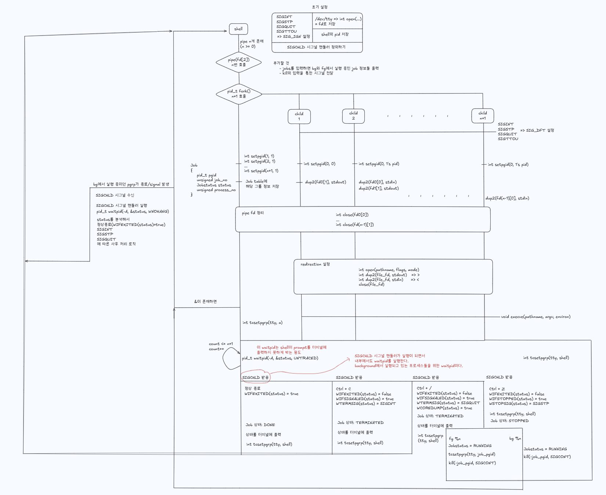

# My New Shell Project
 'shell' project is for recreating the shell (like bash) that operates like a real shell. The purpose for this project is to understand the concept of shell and system calls, implement parser, dive into what actually happens when we give commands to the shell (what happens under the hood...).

My previous 'jhpsh' shell is a simple shell that can perform cd, ls, echo. As I worked on this project, I realized that I was just coding without the process of designing the blueprint of the whole system. In other words, in 'shell' project, before I actually implement the shell, I will go through a process of so called "Design Lifecycle".

## Design Lifecycle
1. Requirements Analysis
    - What am I going to build?
2. Design
    - Draw and blueprint the system. 
    - I will use https://excalidraw.com/ to draw a system diagram. This will help me to understand the system as a whole.
    - Design
        - https://excalidraw.com/#json=Jyhxa7_F_PezLuQMQEtXp,64BEWl2jArRTkxWHCsiZlA
3. Implementation
    - Implement the system I designed.
4. Debugging & Loop...
    - Debug the system and add more features to the system.

## 1st Design Drawing 
