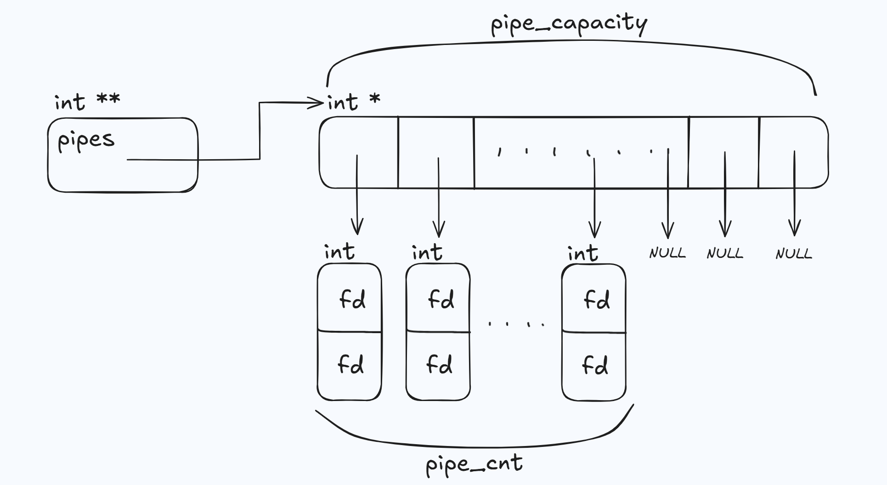
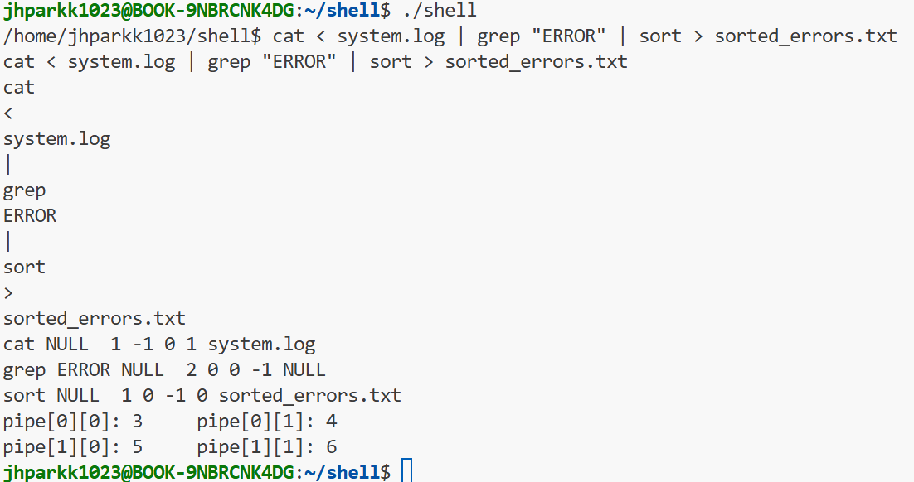

# Executor
Executor forks n(= pipes + 1) childs, execute commands, and wait until the child process group(job) is finished. Executor acts as fork-exec-wait mechanism, which is used for external commands such as ```ls```, ```sort``` etc.


## Creating Pipe
executor.c: ```int create_pipe(int ***pipes, int *pipe_cnt, int *pipe_capacity)```

- Creates N(>= 0) pipes.
    - If shell command ```A | B | C```, it creates 2 pipes.
    - If shell command ```A```, it creates 0 pipes.





- 흐름
    - 첫 명령을 실행할 때(pipe가 존재한다고 가정)
        - pipes = NULL, pipe_capacity = 10
        - pipe_cnt > pipe_capacity이면 pipe_cnt <= pipe_capacity가 될 때까지 +10을 해줌
        - pipes가 가리키는 배열인 int *[]을 pipe_capacity만큼 만듦
            - 초기화 진행, int *[] 배열은 매 loop마다 재사용
        - pipe_cnt만큼 int [2] 배열을 만들고 pipe() 시스템 콜을 통해 pipe 생성
    - 2번 이상 명령어 실행한 경우
        - pipes가 가리키는 배열 int *[]의 모든 요소는 NULL을 가리키는 상태이어야 함
        - pipe fd를 close하고 int [2]를 free해서 pipes가 가리키는 배열 int *[]의 모든 요소가 NULL이 되게 하기 위한 초기화 과정은 create_pipe()에서 하지 않고 pipe_and_redirect()에서 진행함
    - shell을 종료하는 경우
        - pipes가 가리키는 배열 int *[]를 free함