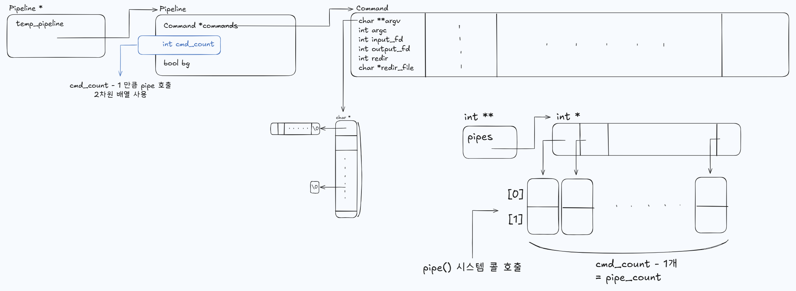

# Executor
Executor forks n(= pipes + 1) childs, execute commands, and wait until the child process group(job) is finished. Executor acts as fork-exec-wait mechanism, which is used for external commands such as ```ls```, ```sort``` etc.


## Creating Pipe
executor.c: ```create_pipe(Pipeline *pipeline, int ***pipes)```

- Creates N(>= 0) pipes.
    - If shell command ```A | B | C```, it creates 2 pipes.
    - If shell command ```A```, it creates 0 pipes.


