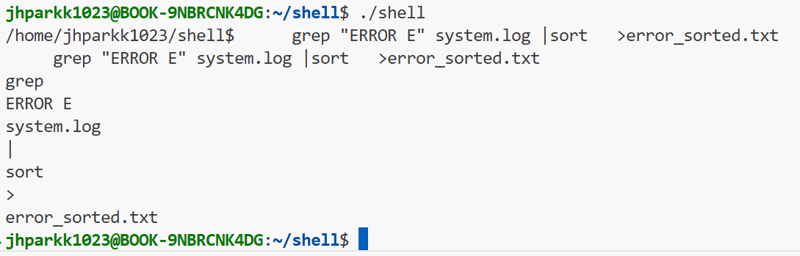
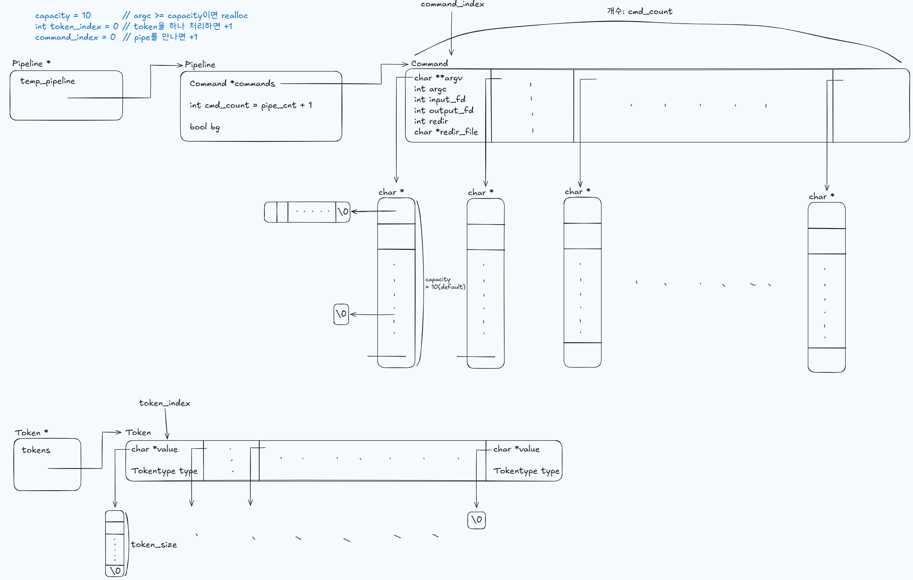
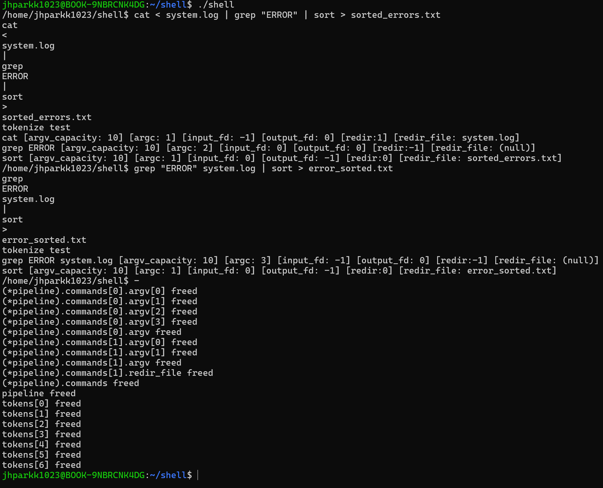

# Parser

- Parser used in this project (shell) is designed by myself and is very simple, not error-aware. I assumed that the input(command) which the user enters to the shell's prompt is grammarly correct. 


### 1. Lexer

- Few things I considered for tokenizing inputs:
    - Blank Space: Usually, input's tokens are seperated between blank space. But |, <, > tokens do not need to be seperated by blank space but instead can be the "border token" itself.
        - Ex
            - ls -l > list.txt
            - ls -l>list.txt

    - Characters in quotes are judged as ordinary tokens. Characters inside the quotes are all normal characters and not any special tokens.
        - Ex
            - echo hello
            - echo "hello"

    - Default size of memory allocation for Token is 10. If the input's token is bigger than 10, reallocate more memory space for the tokens. 

```
memory allocation = 10 memory space for Tokens

while(meets the end of the input (= \0)):
{
    in_quote == false                           in_quote == true

        curr == '|':                            curr != '"', '\'':
            PIPE TOKENIZE                           curr++;
            curr++
            if (curr != space):                 curr == '"', '\'':
                start = curr                        WORD TOKENIZE
                                                    in_quote = false
        curr == '>':                                curr++
            REDIR_OUT TOKENIZE
            curr++
            if (curr != space):
                start = curr

        curr == '<':
            REDIR_IN TOKENIZE
            curr++
            if (curr != space):
                start = curr

        curr == '&':
            BG TOKENIZE
            curr++
            if (curr != space):
                start = curr

        curr == 일반 문자인 경우:
            curr++
            if (curr == isspace, |, <, >, &, \0):
                WORD TOKENIZE

        curr == '"', '\'':
            in_quote = true
            curr++

        curr == isspace:
            curr++
            if (curr != isspace):
                start = curr


    if token size are bigger than capacity, reallocate more memory space
}

END TOKENIZE
```
- ```void tokenize(char *input, Token **token, int *pipe_cnt, int *token_capacity)```
    - 역할
        - input을 Token[]으로 변환
    - 흐름
        - 처음 shell을 실행하고 최초 명령어(input)을 입력했을 때
            - *token = NULL, *pipe_cnt = 0, *token_capacity = 10
            - *token에 Token[] 를 크기 *token_capacity(=10)만큼 동적할당
            - *pipe_cnt는 나중에 parser()함수에서 사용됨. pipe_cnt + 1만큼 Command 객체를 만들어야 하기 때문
            - Token[] 초기화
        - 정상 명령어 입력을 계속 받을 때
            - Token[] 메모리는 재사용
            - 명령어 토큰 개수가 10개 이상인 경우, *token_capacity += 10을 하고 realloc
            - Token.value(char *value)는 함수 내부에서 매번 free하고 초기화
        - shell을 종료할 때
            - main에서 Token.value(char *value)에 할당된 메모리 정리
            - main에서 Token[] 메모리 정리
        - 명령어를 입력 받았는데 tokenize() 내부에서 에러가 났을 때
            - 함수 내부에서 Token[]과 Token.value(char *value) 메모리 정리

    - 내부에서 error가 난 경우 error_exit:
        - Token.value(char *value)와 Token[] 모두 free해서 Token -> NULL(최초상태)가 되도록 만듦

- Result



### 2. Parser
- Parses tokens to commands. 
    - Tokens -> command(argv, argc, ...)

- Pipe number determines the number of command structs.
    - A | B | C: 3 commands are created.

- PIPE token을 만난 경우
    - 이미 cmd_count(pipe + 1)만큼 Command 구조체를 만들었으므로 단순 초기화만 진행 + 다음 command 구조체 설정으로 넘어가기
    - 이후 Pipeline struct 안의 commands 배열에 2개 이상의 요소가 존재하면 그때 pipe 연결 설정하면 됨
    - redirection은 pipe보다 우선순위가 높으므로 pipe을 먼저 설정한 다음에 redirection을 설정하면 redirection 설정이 앞에서 미리 설정한 pipe 설정을 덮어씌우게 됨



- ```int parser(Pipeline **pipeline, Token **tokens, int pipe_cnt)```
    - 역할
        - tokenize()에서 완성된 token 배열을 받아서 Pipeline->commands[] 배열을 만듦
        - pipe이 1개 이상이면 commands[]은 2개 이상이 생김

    - 흐름
        - 처음 shell을 실행하고 첫번재 명령어를 실행할 때
            -  *pipeline = NULL, *tokens = tokenize()로부터 할당된 배열, pipe_cnt = tokenize()로부터 얻은 pipe의 개수
            - *pipeline에 Pipeline 객체 하나 동적 할당
            - Pipeline.commands에 Command[cmd_count] 배열 동적 할당
            - Pipeline.commands.argv에 (char *)[argc_capacity] 배열 동적 할당
            - 나머지 멤버 변수 초기화
        - 2번 이상 명령어 실행할 때
            - Pipeline, Command[], argv[] 메모리는 재사용
                - Command[]와 argv[]는 각각 cmd_count와 argv_capacity보다 많은 메모리가 필요하면 +10을 한 후 재할당
            - argv의 각 요소인 char *는 재사용하지 않고 매번 free하고 초기화
            - Command[]에 새로 할당된 메모리의 멤버변수 초기화
        - shell을 종료한 경우
            - *pipeline이 NULL이 될 때까지 모두 free

    - parser() 내부에서 error가 발생한 경우
        - *pipeline와 연결된 모든 메모리를 free하고 *pipeline = NULL로 초기화

    - 반환값
        - 성공: 0
        - 실패: -1


밑에 사진은 parser에 memory management(malloc, realloc, free) 기능이 추가된 상태를 test한 것.

