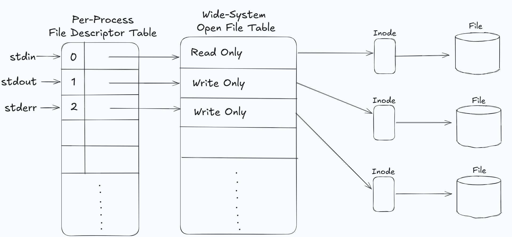
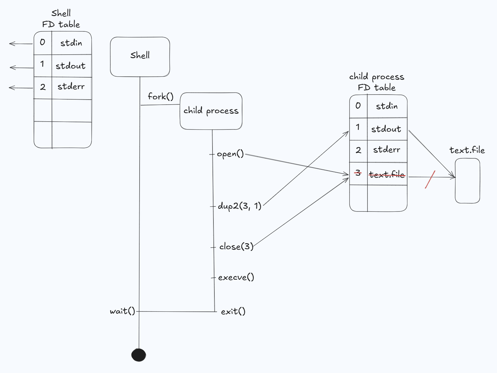
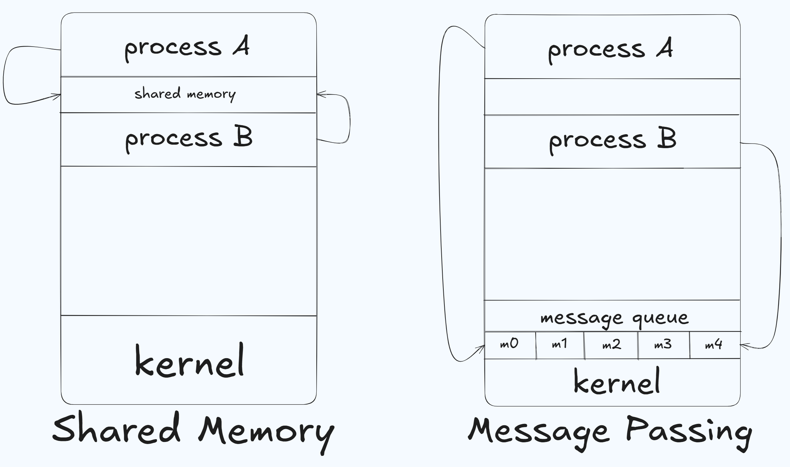
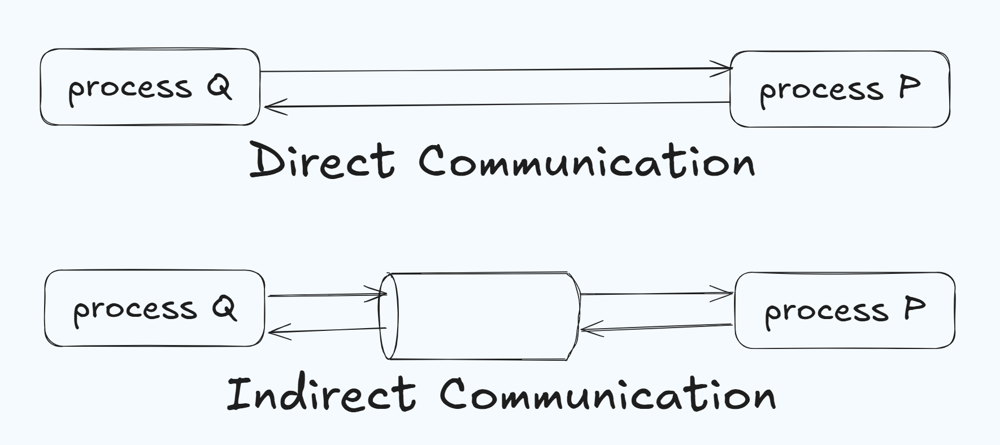
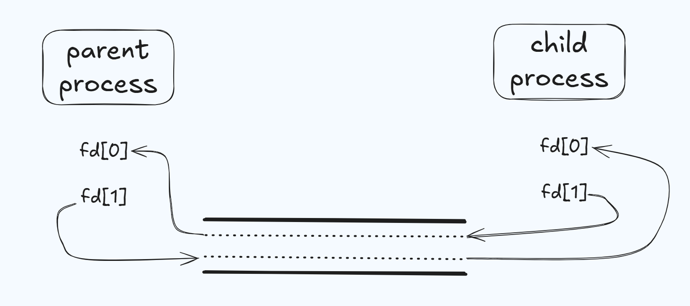
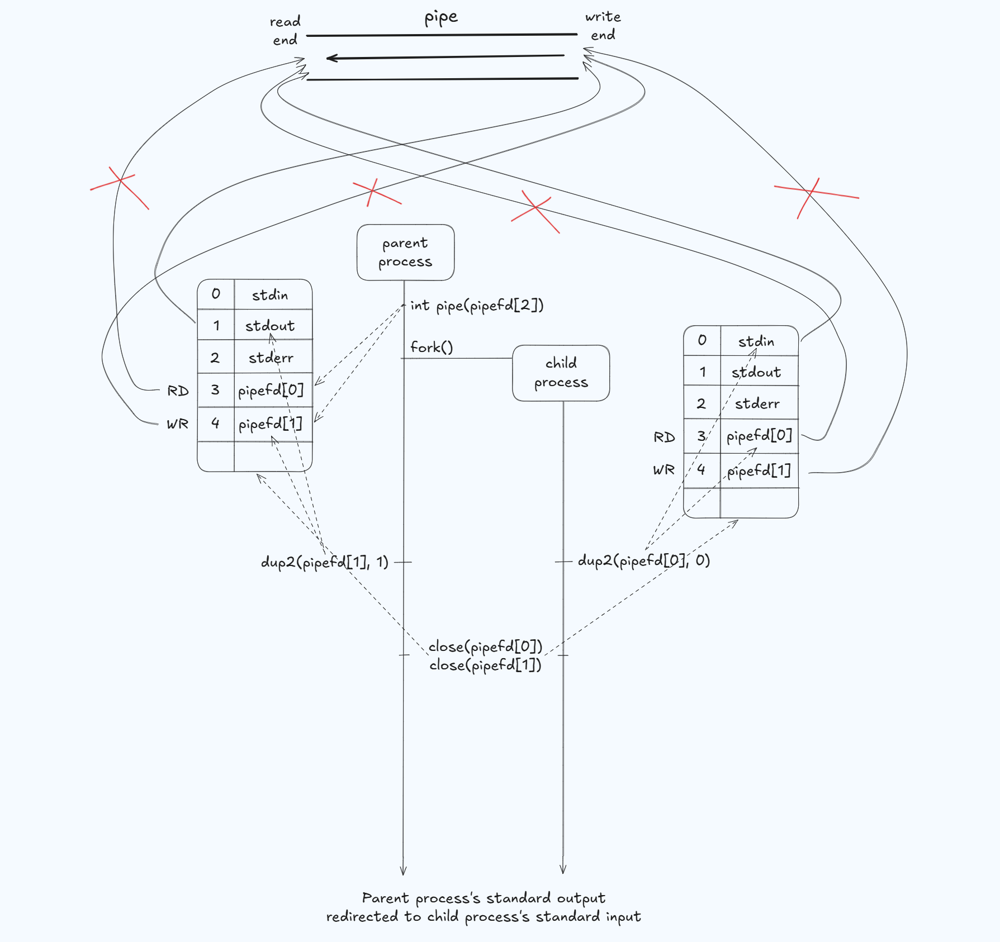

# Shell Implementation Roadmap.

Step|Related Commands|Key System Calls and Learning Keywords
---|---|---
1\. Basic Commmands|ls, mkdir, rm, mv, cp, cat, grep, wc, sort, head, nano|fork(), execve(), wait()
2\. File I/O|>, <, pwd|fork(), open(), close(), dup2(), getcwd()
3\. InterProcess Communicatoin|\||pipe(), I/O Redirection, IPC
4\. Job Control|jobs, fg, bg, kill| signal, waitpid(), tcsetpgrp(), PGID
5\. Shell Built-In Commands| cd, export, set, alias, *|chdir(), getenv(), setenv(), globbing


## 1. Basic Commands

### System Calls
- Basic Commands is run by running external executable program which exists in the file system. 
- The fundamental flow using specific system calls: **Fork-Exec-Wait** Cycle.
    - **fork()**: Copies the parent process and creates a child process.
        - If the shell program does not use fork call and execute basic commands using execve, the new program will overwrite the shell in memory and the shell process will end. 
    - **execve()**: The child process overwrites its memory space into an actual command program(ex: ls, mkdir).
        - `int execve(const char *pathname, char *const _Nullable argv[], char *const _Nullable envp[])`
        - When the shell process wants to execute "ls", the shell looks up the PATH environment variable. But the first argument of execve is `const char * pathname` so we have to parse the value of PATH variable. The PATH variable uses `:` to identify directories, so we can use **strtok** to parse the value using **:** . 
            - Before we parse the value of PATH, we have to **get** the variable PATH. `char *getenv(const char *name)` searches the environment list to find the environment variable 'name' and returns a pointer to the corresponding 'value' string (Note: environ is KEY=VALUE table). 
        - The third argument `char *const _Nullable envp[]` is used to hand over the environment variable vector to the child process. The **environ** is conventionally used for the third input argument. 'environ' is essential for the child process to normally execute their behavior. It is a collection of dynamic configuration values ​​that affect the behavior of processes (running programs) at the operating system (OS) level. Global information necessary for application execution, such as system paths, user information, and debug mode (KEY=VALUE). 
        - `int access(const char *path, int mode)` system call checks whether the calling process can access the file path. To use the 'execve' call, we strtok() the PATH var. There are numbers of file path and we have to check whether the path is accessable. Argument `int mode` specifies the accessibility checks to be performed and is either the value of `F_OK`(tests for the existence of the file), `R_OK`(tests for read), `W_OK`(write), `X_OK`(execute).
    - **wait()**: The parent process waits till the child process ends its execution. When the child process ends its execution, the parent process receives the exit status code and cleans up the resources that the child process had occupied. 
        - **wait()** system call is used to wait for state change in child of the calling process, and obtain information about the child whose state has changed: __Terminated, Stopped, Resumed__. In case of Terminated, performing a wait allows the system to release the resources associated with the child. If a wait call is not performed, the terminated child remains **zombie process**. 
            - `wait(NULL)` is only returned when the child process is terminated.
        - When wait call is not performed, the kernel maintains a set of information(PID, termination status, resource usage informatation) to allow the parent to later perform a wait to obtain information about the child. The zombie process consumes the kernel process table and if this table is filled, it will not be possible to create further processes. 
        - If a parent process is terminated, the zombie process is adopted by **init** process. The init process automatically performs a wait to remove the zombies.
        - `pid_t wait(int *wstatus)` has 1 input arg. If the parent process passes the address of an integer variable, the kernel directly writes the child process's termination information to that address. If 'NULL' is input, the parent waits till the child process is done and finished the execution. 
            - 'wstatus' is a bitmask form and contains informations such as
                1) Exit Status: If the child process calls 'exit(5)', 5 is included to 'wstatus'
                2) Termination Signal: It includes information on which signal (e.g., SIGKILL) caused the forced termination.
                3) Core Dump: It includes whether a core dump file was generated upon termination. Core dump is an information about whether the child process left behind a "black box (core dump file) for debugging" when it died.
            - Because the bits stored in wstatus are difficult for humans to read visually, dedicated macro functions are used in system programming to interpret them.
                1) `WIFEXITED(status)`: It returns True if the child terminates normally with exit() or return
                2) `WEXITSTATUS(status)`: When the above condition is true, extract the actual exit code (0~255) passed by the child.
                3) `WIFSIGNALED(status)`: Returns true if the child died abnormally due to a signal.
                4) `WTERMSIG(status)`: It tells you what the signal number is that caused the child's death.
                5) `WCOREDUMP(wstatus)`: Returns true if the child produced a core dump. This function should be employed when `WIFSIGNALED` returned true.

                
                Signal is a 'asynchronous alarm' or 'software interrupt' which signals the process by the OS. When signal has arrived, the process stops its action immediately and perform the action (signal handler) promised for the corresponding signal. 

                시그널 이름|번호|기본 동작 (Default Action)|상태 변화 결과|주요 발생 상황
                ---|---|---|---|---
                SIGINT|2|Terminate|Terminated|Ctrl + C 입력 시 (인터럽트)
                SIGQUIT|3|Terminate + Core Dump|Terminated|Ctrl + \ 입력 시
                SIGKILL|9|Terminate (강제)|Terminated|kill -9 명령 (절대 무시 불가)
                SIGTERM|15|Terminate|Terminated|kill 기본 명령 (종료 요청)
                SIGSEGV|11|Terminate + Core Dump|Terminated|잘못된 메모리 참조 (Segfault)
                SIGSTOP|17, 19, 23|Stop (강제)|Stopped|프로세스를 즉시 정지 (무시 불가)
                SIGTSTP|18, 20, 24|Stop,Stopped|Ctrl + Z 입력 시 (터미널 정지)
                SIGCONT|19, 18, 25|Continue|Resumed|정지된 프로세스를 다시 실행
                SIGCHLD|17, 20, 18|Ignore|(변화 없음)|자식의 상태가 변했음을 부모에 알림

                * SIGINT (Ctrl+C) can be handled by code within the program to "give it some time to save data before it dies," but stronger signals like SIGSTOP or SIGKILL cannot be rejected by the process.


    - **exit()**: The child process exits and signals the parent process. 
        - `void exit(int status)` call has two consants, EXIT_SUCCESS(0) and EXIT_FAILURE(1 or other), for input argument. 


### simple blueprint


### pseudo code for Basic Command

    ```C
    pid = fork();
    if (pid != 0)       // parent process
        wait(NULL);
    else if (pid == 0)  // child process
        {
            get PATH value string.
            dupstr = duplicate the value string. -> strtok changes the original value string.
            dir = strtok(dupstr, ":")
            while(dir != NULL)
            {
                full_path = dir + command_name
                if (access(full_path, X_OK) == 0)
                    execve(full_path, argv, environ)
                    break
                dir = strtok(NULL, ":")
            }
            exit();
        }
    ```

    
## 2. File I/O


### File Descriptor
- File Descriptor is an __Non-negative Integer__ that kernel manages. In Linux, when a process opens a file, the kernel writes the address of the kernel object containing the file's information into an empty space in the 'File Descriptor Table' dedicated to that process. It then informs the process of that 'space number (index),' which is the FD. 

- Linux follows the philosophy that "everything is a file." Therefore, not only ordinary files but also hardware devices, network sockets, and inter-process communication (IPC) channels are all handled through FDs using the same read() and write() interfaces.

- Standard FD
    - 0: stdin
    - 1: stdout (buffer)
    - 2: stderr (no buffer)

### 3-level File Management Structure Inside the Kernel
- Per-Process FD Table
    - Per-Process FD Table is included in Linux's task_struct(PCB).
    - The index is FD, and each entry hase a pointer (that points to a Wide-System Open Table) and a FD flag.
    - Valid only within the process. (Process A's 3 and Process B's 3 can point to completely different files.)

- System-wide Open File Table
    - This is a table that manages the status of all files currently open across the entire OS
    - File Offset: Location information regarding how far the current file has been read or written.
    - Status flags: Read-only, Write-only, Non-blocking, etc. (O_RDONLY, O_APPEND, etc.).
    - Reference Count: Records the number of FDs pointing to this open file description. (It is removed from the table when it reaches 0.)
- V-node / Inode Table
    - It is a table containing physical information about files stored on the actual disk.
    - Content: Metadata regarding file type, permissions, file size, location of data blocks on the disk, etc.
    - Features: Multiple open file descriptions can exist for the same file, but only one inode exists.



### FD Sharing and Independence
- Behavior of fork() (FD inheritance)
    - When you use fork(), the child copies the parent's process-specific FD table exactly as it is.
    - Effect: If the child reads the file and shifts the offset, the parent will also start reading from that shifted position when reading the file. (Offset shared)
- Behavior of double open()
    - Two FDs are created and Open File Table entry is created for each FD but both points to the same Inode. 
    - Effect: The two FDs have independent offsets. In other words, reading from one side does not affect the read position of the other.

### stdout, stdin, stderr
- __stdout(Standard Output)__: Sending data to a montior
    1. When a process calls printf, the data remains in the process's internal memory, having not yet even reached the kernel. 
        - Library Buffer: printf belongs to the C library (libc). The string "Hi" is initially stored in the user-level buffer managed by the stdout FILE struct object.
        - Flush & System Call: When a newline character (\n) is encountered or the buffer is full (Lined Buffer), the library calls the `write(1, "Hi", 2)` system call. At this point, it encounters the PCB's FD table holding the number '1 (stdout)
        - stdout is a FILE struct object that holds a few information about FD and user buffer. 
        ```C
        #include <stdio.h>

        struct _iobuf {
        char* _ptr;      // 버퍼 내의 현재 읽기/쓰기 위치
        int   _cnt;      // 버퍼에 남아있는 데이터의 양 (바이트 단위)
        char* _base;     // 버퍼의 시작 주소
        int   _flag;     // 파일 상태 플래그 (에러, EOF, 읽기/쓰기 모드 등)
        int   _file;     // 운영체제로부터 할당받은 파일 식별자 (File Descriptor)
        int   _charbuf;  // 버퍼가 없을 때 사용하는 임시 버퍼
        int   _bufsiz;   // 버퍼의 크기
        char* _tmpfname; // 임시 파일 이름
        };
        typedef struct _iobuf FILE;
        ```
    2. The kernel starts searching the process's resources using the received FD number 1.
        - Process FD Table: The kernel looks at the FD table in the corresponding process's PCB. The address of the 'open file table' is written in column 1 of the index.
        - [Open File Table]: The kernel follows the address to check the 'Open File Table'.
        - Since the hardware may be busy, the kernel safely copies the data to the kernel's internal terminal (TTY) buffer for the time being.
        - The open file table entry's information tells that the destination of this data is **Terminal (TTY)**, and it is write-only.
        - Inode Table (Device): It follows the pointer in the open file table to locate the **Device Inode**. This is the entry point connected to the actual terminal device driver.
    3. Device Driver & Monitor: "Hi" contained in the kernel buffer is passed to the graphics card according to the device driver's schedule and ultimately appears as a pixel on the monitor screen.

- __stderr__: Performs similarly as stdout, but does not go through a process of a user buffer and instead immediately writes to the kernel buffer.

- __stdin(Standard Input)__: Sending data from keyboard to a process memory
    1. When a process calls scanf, it does not run directly to the kernel but checks if there is data in the user space.
        - Check Library Buffer: scanf first flips the user-level input buffer managed by the stdin object (FILE structure)
            - If there is leftover data from a previous input (e.g., if "Hello World" was entered but the previous scanf only retrieved "Hello"), it is retrieved directly from the user buffer without requesting it from the kernel.
        - System Call Invocation: If the buffer is empty, the library calls the read(0, buf, size) system call. At this time, it requests data by presenting '0 (stdin)' to the kernel.
    2. Kernel Space
        - Process FD Table: The kernel looks at index 0 of the FD table. The address of the 'open file table' is written there.
        - Open File Table: It is recorded that this data is from the terminal (TTY) and is read-only.
        - Inode Table & Sleep: The kernel checks whether there is current keyboard input through the terminal device inode.
            - If there is no input data, the kernel switches the process to a sleep/waiting state. At this time, the process waits quietly without using the CPU.
    3. Hardware & Interrupt
        - Hardware Interrupt: When a user presses a key, the keyboard controller sends an interrupt signal to the CPU that data has arrived and processes it
        - Kernel TTY Buffer: The kernel's device driver intercepts input characters and stacks them sequentially in the kernel's terminal buffer. When Enter is pressed, the kernel determines that it is now safe to send the data.
    4. Process Wake-up and Parsing
        - Process Wake-up: The kernel wakes up a sleeping process (transitions to the Ready state).
        - Data Copy: Data contained in the kernel buffer is copied(read) to the library buffer in user space.
        - Parsing: Finally, scanf converts the string (e.g., "123") entered into the library buffer into a number according to the format requested by the user (e.g., %d) and stores it in a variable.

---
### System Calls
- File I/O and Redirection are a procedure that the shell and the __file__ communicate.
- The key concept of this part is looking at how these system calls use File Descriptor and redirect them.

    - `int open(const char *pathname, int flags) / int open(const char *pathname, int flags, mode_t mode);`
        - open() gets pathname and returns a FD. This FD is then used by read, write, close system call. In success returns the lowest unused FD number, in failure returns -1 and set `errno`.
        - Flags
            1. Essential Flags
            
            Flag|meaning
            ---|---
            O_RDONLY|read only
            O_WRONLY|write only
            O_RDWR|read/write

            2. File Creation Flags
                - The flag creation flag affects the operation of open() call itself. It cannot be modified by `fcntl`.
            
            Flag|meaning
            ---|---
            O_CREATE|Create file if not exist.
            O_TRUNC|If the file already exist and the access mode allows writing, it truancates the length to 0.
            O_EXCL|It is used with O_CREATE and if the file already exists, outputs an error.
            O_CLOEXEC|Close the fd automatically in the process when `execve` is called.

            3. File Status Flag
                - It decides the I/O operation at the opened file, and can be modified by `fcntl`.

            Flag|meaning
            ---|---
            O_APPEND|When write, always put the data at the end of the file. Atomicity is guaranteed for this flag (move to the end + write data) at local file system so no race condition.
            O_NONBLOCK|If there is no data to read, do not wait and immediately return. 
            O_DIRECT|Do not go through OS cache but instead write to the Disk immediately.

        - Modes
            - Specifies the file mode bits to be applied when a new file is created. If neither O_CREATE or O_TMPFILE is specified in flags, then mode is ignored. 

            Mode|meaning
            ---|---
            S_IRUSR|read user
            S_IWUSR|write user
            S_IXUSR|execute user
            S_IRGRP|read group
            S_IWGRP|write group
            S_IXGRP|execute group
            S_IROTH|read other
            S_IWOTH|write other
            S_IXOTH|execute other

            - __umask__: The kernel filters permissions by applying a value called umask for system security.
    
    - `int dup(int oldfd);`
    - `int dup2(int oldfd, int newfd)`
        - The `dup` system call allocates a new file descriptor that refers to the same open file description as the descriptor __oldfd__. The new file descriptor number is guaranteed to be the lowest-numbered file descriptor that was unused in the calling process.
        - After a successful return, the old and new file descriptors may be used interchangeably. Since these two refer to the same open file description, they share the file offset and file status flags. 
        - The two file descriptors do not share file descriptor close-on-exec flags. The close-on-exec flag for the duplicate descriptor is off. 
            - Ex

            Stage|FD 3 (original)|FD 4 (Copied)|Note
            ---|---|---|---
            Right after `dup`|FD_CLOEXEC ON|FD_CLOEXEC OFF|When copied, thd file descriptor flags are not copied.
            Call `execve`|Closed|Open (maintained)|The kernel cleans up FD 3.
            New Program|Unaccessable|Accessable|The new program has FD 4 but not FD 3.

            - Applied to Shell
                - `ls > out.txt`: FD 3 is created. FD 3 has O_CLOEXEC flag for securiy reason.
                - `dup2(3, 1)`: Now FD 1 __stdout__ is pointing to the same open file table entry as FD 3.
                - If `dup2(3, 1)` duplicates FD 3's O_CLOEXEC flag to FD 1, when `execve` is executed FD 1 Standard Output is closed and `ls` would not be able to print the context anywhere.
        - The `dup2` system call operates as same as the `dup` call, but the main difference is that instead of using the lowest-numbered unused file descriptor, it uses the file descriptor number specified in __newfd__. Now the __newfd__ is pointing to the same open file table entry as __oldfd__. 
        - `dup2`'s Advantage
            1. __Silent Close__: The kernel silently closes the oldfd. 'Silently' means when it closes oldfd, it does not inform any error to the user and just copies the newfd.
            2. __Atomiciy__: "Closing the oldfd" procedure and then "Copying to newfd" is atomicity, which means no commands can come to the middle of the two procedure.
            - __Race Condition__ when using `close()` and `dup()` instead of `dup2()`
                ```C
                close(1);
                // <--- race condition can occur
                newfd = dup(3);
                ```

                1. Thread A closes FD 1. Now FD 1 in the FD table is empty.
                2. Right after Thread A's `close(1)` call has returned and Thread B interferes and opens another FD using `open()`, now FD 1 is in use.
                3. After Thread B opens fipe using FD 1 and Thread A calls `dup(3)`, Thread A expected FD 1 but the kernel assigns FD 4 (the lowest non-negative integer unused). This causes a problem that the user's expected redirected FD 1 but it is now FD 4. (ex: `ls > out.txt` => Thread A `write(1, 'data', len)`'s output is going to different file instead of out.txt) 
        - Return Value
            - On success, returns the new file descriptor. On failure, returns -1.

    - `int close(int fd)`
        - `close()` closes a file descriptor so that it no longer regers to any file and may be reused.
        - __Reusability__: FD can be reused when opening a new file.
        - __Resource Clearing__: If the corresponding FD was the last referencing FD to the file, the kernel clears the system resources related to the file.
        - __File Deletion__: If `unlink()` was reserved to delete the file, the moment `close()` is called, the file is permanently deleted from the disk.
        - __Record Lock Side Effect on Multi-Threading Environment__
            - When a process closes a file, all locks held by that process on the file are released.
            - Record Lock locks the specific range of the file. The range could be the whole file.
            - The owner of the record lock is the process itself.
                1. Process A's Thread Z opens `test.txt` with FD 3 and locks the whole file. 
                2. Process A's Thread X opens `test.txt` with FD 4 and processes I/O operation.
                3. After the operation, Thread Z closes FD 4.
                4. __Result__: All locks that Process A had set via fd 3 are released.

                - Why?
                    - The owner of the record lock is the 'Process A'.
                    - Thread Z and Thread X are in the same Process A and therefore shares the Process A's PID(TGID). In the kernel's perspective, Thread Z and Thread X shares the same TGID so it does not block Thread X. 
                    - When Thread X closes FD 4, the kernel thinks Process A is closing FD so it releases all the locks that Process A has set. 

            - Solution
                - Use Open File Description Lock `F_OFD_SETK`. The owner of the lock is the Open File Description so it releases locks only when the corresponding FD (or copy) is closed. 
    - `char *getcwd(char buf[size], size_t size)`
        - Stores an absolute pathname of the current working directory of the process to `buf` and returns `buf` address. 
        - If `buf` is `NULL`, it allocates the buffer dynamically using `malloc()`. The allocated buffer has the length `size` if `size` is bif enough to store the pathname. If 0, length is pathname len. The caller should free the memory using `free()`.
        - Return Value
            - On success, returns the address of `buf` storing the pathname. On failure, returns `NULL` and sets `errno`.
        - Note: When you are working in a directory and want to return to it later
            - Method A (string method)
                1. Use `getcwd()` to store the current working directory.
                2. Use `chdir()` to move to another directory.
                3. It returns using the saved 'current working directory'.
            - Method B (FD method)
                1. Open the current directory (.) and obtain the number FD using `open()`.
                2. Go to another directory and do something
                3. use `fchdir(fd)` and come back to the current working directory
            - Performance
                - Method A: __Path resolution__ is needed. 
                - Method B: It already holds a FD that directly points to the __inode__ of that directory. The kernel can "jump" immediately to that location without needing to interpret the path.
            - Reiability
                - Method A: If someone changes the parent directory's name, path resolution is failed because the path string value has been changed.
                - Method B: Since the file descriptor points directly to the Inode, it can return to the current working directory despite the path name string value has been changed.
            - Method B is faster and safer, but it consumes 1 entry on the FD table. 

### Redirection __`>`__ Flow 
1. fork(): Creates a child process
2. open(): Open a file in the child process. A new FD (ex: 3) is assigned.
3. dup2(3, 1): Copies the file destination pointed to by FD 3 to 1 (standard output).
4. close(3): The copy is complete so it closes FD 3.
5. execve(): Run `ls` program. `ls` prints the output to FD 1 as usual, but FD 1 is pointing to a file.



```C
pid = fork()    // create child process
if (pid == 0)   // child process
{
    // open file. 
    fd = open("./file",
                 O_WRONLY | O_CREATE | O_TRUNC,
                 S_IRUSR | S_IWUSR | S_IRGRP | S_IROTH);
    
    // duplicate fd to 1
    dup2(fd, 1);

    // close fd
    // O_CLOSEXEC can be used at open()
    close(fd);

    // execute program
    // 'pathname' argument should be parsed before using 'execve'. Parses PATH using strtok() with :
    execve(executable program fullpath, command args, environ);

    // 'execve' function did not worked and exit with exit code 1.
    exit(EXIT_FAILURE);
}
else
{
    // wait until the child process is complete.
    wait(NULL);
}
```

### Redirection __`<`__ Flow
1. fork(): Creates a child process
2. open(): Open a file in the child process. A new FD (ex: 3) is assigned.
3. dup2(3, 0): Copies the file destination pointed to by FD 3 to 0 (standard input).
4. close(3): The copy is complete so it closes FD 3.
5. execve(): Run `cat` program. `cat` reads the data from FD 0 as usual, but FD 0 is pointing to a file, so it reads the data in the file. 

### PWD
1. The shell calls `getcwd()`.
2. The kernel retrieves the current directory information stored in the current process's control block (PCB).
3. Prints the retrieved path string to standard output (FD 1).


## 3. InterProcess Communication
### IPC
- Allow two or more processes to exchange data
- Two fundamental models of IPC

    

    - __Shared Memory (POSIX Shared Buffer)__
        - Producer-Consumer Problem
            - A producer produces information that is consumed by a consumer.
            - A producer can fill (write) the buffer, and a consumer can empty (read) the buffer.
            - The buffer is a shared memory that is shared by the producer and consumer processes.
                - A process cannot approach a different process's memory space, so shared memory is needed.
        - Problem of using Shared Memory for IPC
            - It requires that processes share a region of memory and that the code for accessing and manipulating the shared memory be written by the application programmer.
            - It can be solved by using Message Passing 
    - __Message Passing (Pipes)__
        - OS provides the means for cooperating processes to communicate with each other via a message-passing facility.
        - Two operations of the message-passing facility
            - `send(message)`
            - `receive(message)`
        - Communication Links
            - If processes want to communicate, a communication link is needed to send data and receive data.
            - Communication link can be implemented in a variety of ways.
                - __direct__ or __indirect__ communication
                - __synchronous__ and __asynchronous__ communication
                - __automatic__ or __explicit__ buffering

        

        - __Direct Communication__
            - Each process that wants to communicate must explicitly __name__ the recipient or sender of the communication.
                - `send(P, message)`: send a message to process P
                - `receive(Q, message)`: receive a message from process Q
            - Links are established __automatically__.
            - A link is associated with __exactly two processes__
            - There exists __exactly one link__ between each pair of processes
        - __Indirect Communication__
            - The messages are sent to and received from __mailboxes__ or __ports__.
                - `send(A, message)`: send a message to mailbox A.
                - `receive(A, message)`: receive a message from mailbox A.
            - Mailbox (ports)
                - An abstract object where messages can be placed by processes and messages can be removed.
            - Links are established between a pair of processes only if __both members__ of the pair have __a shared mailbox__.
            - A link may be associated with __more than two processes__.
            - A number of __different links may exist__, between each pair of processes with each link corresponding to one mailbox.
            - OS provides a mechanism that allows to process to do
                1. __Create__ new mailbox
                2. __Send__ and __Receive__ messages through the mailbox.
                3. __Delete__ a mailbox
            - Different design options for implementation
                - __Blocking (Synchronous)__ or __Non-blocking (Asynchronous)__
                ---
                - __Blocking send__: the sender is blocked until the message is received.
                - __Non-blocking send__: the sender sends the message and continue.
                - __Blocking receive__: the receiver blocks until a message is available.
                - __Non-blocking receive__: the receiver retrieves either a valid message or a null message
                ---
    - __Pipes__
        - IPC mechanism in early UNIX systems.
        - A __pipe__ acts as a conduit allowing two processes to communicate.
        - __4 Issues of Pipe Implementation__
            1. __Unidirectional__ or __Bidirectional__
            2. __Half-Duplex__ or __Full-Duplex__
            3. __Relationship__ between the communicating process (No relationship is required for the communicating process)
            4. Pipes in __network__ (socket)
        - __2 Types of Pipes__
            - __Ordinary pipes__
                - Cannot be accessed from outside the process that created the pipe.
                - A parent process creates a pipe and uses it to communicate with a child process that it created.
                - It allows two processes to communicate in __producer-consumer__ fashion.
                    - The producer writes to one end of the pipe (write end)
                    - The consumer reads from the other end (read end)
                - Pipe is __unidirectional__. Two-way communication is possible by using two pipes.

                

                - __Constructing Pipes__
                    - `pipe(int fd[])`
                    - `fd[0]`: the read end of the pipe
                    - `fd[1]`: the write end
                
                Example Code
                ```C
                int fd[2];
                pid_t pid;

                // create pipe
                pipe(fd);

                pid = fork()

                if (pid > 0)        // parent process
                {
                    // close read end FD
                    close(fd[0]);
                    // write to the write end FD
                    write(fd[1], message, strlen(message) + 1);
                    // close write end FD
                    close(fd[1]);
                }
                else if (pid == 0)  // child process
                {
                    close(fd[1]);
                    read(fd[0], buffer, buffer_size);
                    printf("%s\n", buffer);
                    close(fd[0]);
                }
                ```
            - __Named pipes__
                - Can be accessed without a parent-child relationship.
---
### System Call
- `int pipe(int pipefd[2])`
    - `pipe()` creates a pipe which is unidirectional data channel for IPC. 
    - `pipefd[2]` is used to return two FD referring to the ends of the pipe. `pipefd[0]` refers to the read end and `pipefd[1]` refers to the write end of the pipe. Data written in the write end is buffered by the kernel until it is read from read end. 
    - On success, returns 0. On failure, -1 is returned and `errno` is set.

### __|__ Flow
1. Parent process creates pipe using `pipe()`
2. Creates child process using `fork()`. The child process has the same FD table as parent process and therefore parent and child are pointing to the same pipe.
3. Connect stdout and stdin to `pipefd[0]` and `pipefd[1]` using `dup2()`. 
    - Parent process: Standard Output -> `pipefd[1]`
    - Child process: Standard Input -> `pipefd[0]`
4. Close unused FD using `close()`. If you do not close unused `pipefd[1]` in child process and `pipefd[0]` in parent process, parent process's `pipefd[0]` would be in infinite loop because it will wait until child process's `pipefd[1]` writes data to the pipe. `pipefd[0]` thinks the data will be sent from the pipe and wait, not being able to receive `EOF`.



### Applied to Shell Command `ls | wc -l`
- When pipe is applied to shell command like `ls | wc -l`, 2 child processes are needed. 
    - Shell process -> Process A, Process B.
    1. Shell creates pipe using `pipe()`.
    2. Shell process creates process A and process B using `fork()`.
    3. Shell waits both processes using `waitpid()`.
    4. Process A duplicates `pipefd[1]` to `stdout` and Process B duplicates `pipefd[0]` to `stdin`. 
    5. A and B close unused FD using `close()`.
    6. 