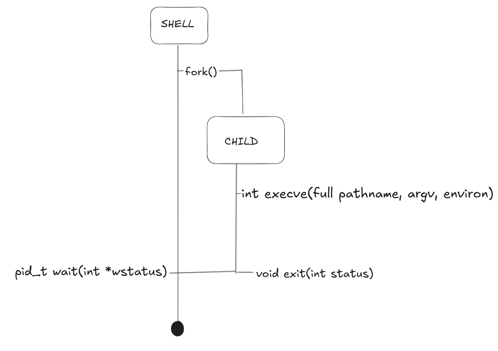

# Shell Implementation Roadmap.

Step|Related Commands|Key System Calls and Learning Keywords
---|---|---
1\. Basic Commmands|ls, mkdir, rm, mv, cp, cat, grep, wc, sort, head, nano|fork(), execve(), wait()
2\. File I/O|>, <, pwd|open(), close(), dup2(), getcwd()
3\. InterProcess Communicatoin|\||pipe(), I/O Redirection, IPC
4\. Job Control|jobs, fg, bg, kill| signal, waitpid(), tcsetpgrp(), PGID
5\. Shell Built-In Commands| cd, export, set, alias, *|chdir(), getenv(), setenv(), globbing


## 1. Basic Commands
- Basic Commands is run by running external executable program which exists in the file system. 
- The fundamental flow using specific system calls: **Fork-Exec-Wait** Cycle.
    - **fork()**: Copies the parent process and creates a child process.
        - If the shell program does not use fork call and execute basic commands using execve, the new program will overwrite the shell in memory and the shell process will end. 
    - **execve()**: The child process overwrites its memory space into an actual command program(ex: ls, mkdir).
        - `int execve(const char *pathname, char *const _Nullable argv[], char *const _Nullable envp[])`
        - When the shell process wants to execute "ls", the shell looks up the PATH environment variable. But the first argument of execve is `const char * pathname` so we have to parse the value of PATH variable. The PATH variable uses `:` to identify directories, so we can use **strtok** to parse the value using **:** . 
            - Before we parse the value of PATH, we have to **get** the variable PATH. `char *getenv(const char *name)` searches the environment list to find the environment variable 'name' and returns a pointer to the corresponding 'value' string (Note: environ is KEY=VALUE table). 
        - The third argument `char *const _Nullable envp[]` is used to hand over the environment variable vector to the child process. The **environ** is conventionally used for the third input argument. 'environ' is essential for the child process to normally execute their behavior. It is a collection of dynamic configuration values ​​that affect the behavior of processes (running programs) at the operating system (OS) level. Global information necessary for application execution, such as system paths, user information, and debug mode (KEY=VALUE). 
        - `int access(const char *path, int mode)` system call checks whether the calling process can access the file path. To use the 'execve' call, we strtok() the PATH var. There are numbers of file path and we have to check whether the path is accessable. Argument `int mode` specifies the accessibility checks to be performed and is either the value of `F_OK`(tests for the existence of the file), `R_OK`(tests for read), `W_OK`(write), `X_OK`(execute).
    - **wait()**: The parent process waits till the child process ends its execution. When the child process ends its execution, the parent process receives the exit status code and cleans up the resources that the child process had occupied. 
        - **wait()** system call is used to wait for state change in child of the calling process, and obtain information about the child whose state has changed: __Terminated, Stopped, Resumed__. In case of Terminated, performing a wait allows the system to release the resources associated with the child. If a wait call is not performed, the terminated child remains **zombie process**. 
            - `wait(NULL)` is only returned when the child process is terminated.
        - When wait call is not performed, the kernel maintains a set of information(PID, termination status, resource usage informatation) to allow the parent to later perform a wait to obtain information about the child. The zombie process consumes the kernel process table and if this table is filled, it will not be possible to create further processes. 
        - If a parent process is terminated, the zombie process is adopted by **init** process. The init process automatically performs a wait to remove the zombies.
        - `pid_t wait(int *wstatus)` has 1 input arg. If the parent process passes the address of an integer variable, the kernel directly writes the child process's termination information to that address. If 'NULL' is input, the parent waits till the child process is done and finished the execution. 
            - 'wstatus' is a bitmask form and contains informations such as
                1) Exit Status: If the child process calls 'exit(5)', 5 is included to 'wstatus'
                2) Termination Signal: It includes information on which signal (e.g., SIGKILL) caused the forced termination.
                3) Core Dump: It includes whether a core dump file was generated upon termination. Core dump is an information about whether the child process left behind a "black box (core dump file) for debugging" when it died.
            - Because the bits stored in wstatus are difficult for humans to read visually, dedicated macro functions are used in system programming to interpret them.
                1) `WIFEXITED(status)`: It returns True if the child terminates normally with exit() or return
                2) `WEXITSTATUS(status)`: When the above condition is true, extract the actual exit code (0~255) passed by the child.
                3) `WIFSIGNALED(status)`: Returns true if the child died abnormally due to a signal.
                4) `WTERMSIG(status)`: It tells you what the signal number is that caused the child's death.
                5) `WCOREDUMP(wstatus)`: Returns true if the child produced a core dump. This function should be employed when `WIFSIGNALED` returned true.

                
                Signal is a 'asynchronous alarm' or 'software interrupt' which signals the process by the OS. When signal has arrived, the process stops its action immediately and perform the action (signal handler) promised for the corresponding signal. 

                시그널 이름|번호|기본 동작 (Default Action)|상태 변화 결과|주요 발생 상황
                ---|---|---|---|---
                SIGINT|2|Terminate|Terminated|Ctrl + C 입력 시 (인터럽트)
                SIGQUIT|3|Terminate + Core Dump|Terminated|Ctrl + \ 입력 시
                SIGKILL|9|Terminate (강제)|Terminated|kill -9 명령 (절대 무시 불가)
                SIGTERM|15|Terminate|Terminated|kill 기본 명령 (종료 요청)
                SIGSEGV|11|Terminate + Core Dump|Terminated|잘못된 메모리 참조 (Segfault)
                SIGSTOP|17, 19, 23|Stop (강제)|Stopped|프로세스를 즉시 정지 (무시 불가)
                SIGTSTP|18, 20, 24|Stop,Stopped|Ctrl + Z 입력 시 (터미널 정지)
                SIGCONT|19, 18, 25|Continue|Resumed|정지된 프로세스를 다시 실행
                SIGCHLD|17, 20, 18|Ignore|(변화 없음)|자식의 상태가 변했음을 부모에 알림

                * SIGINT (Ctrl+C) can be handled by code within the program to "give it some time to save data before it dies," but stronger signals like SIGSTOP or SIGKILL cannot be rejected by the process.


    - **exit()**: The child process exits and signals the parent process. 
        - 'void exit(int status)' call has two consants, EXIT_SUCCESS(0) and EXIT_FAILURE(1 or other), for input argument. 


## simple blueprint


### pseudo code for Basic Command

    ```C
    pid = fork();
    if (pid != 0)       // parent process
        wait(NULL);
    else if (pid == 0)  // child process
        {
            get PATH value string.
            dupstr = duplicate the value string. -> strtok changes the original value string.
            dir = strtok(dupstr, ":")
            while(dir != NULL)
            {
                full_path = dir + command_name
                if (access(full_path, X_OK) == 0)
                    execve(full_path, argv, environ)
                    break
                dir = strtok(NULL, ":")
            }
            exit();
        }
    ```

    
## 2. File I/O

